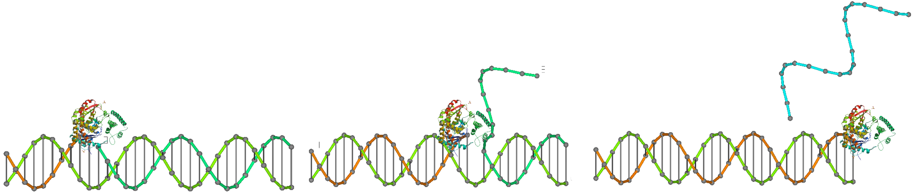
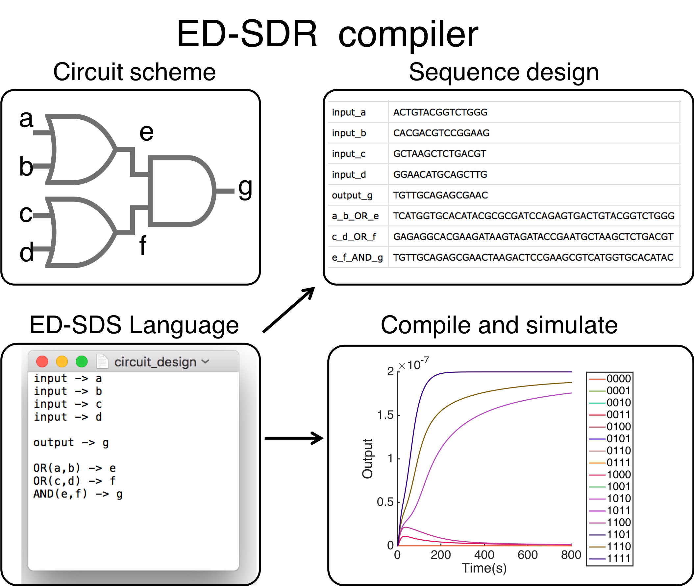

# ED-SDR compiler

A package to design DNA molecular circuit driven by enzyme 

# Usage: 
  - the circuit design script is written in txt files:   `AutoCircuitDesign('AND_gate.txt')`
  - The design sequence will be in the circuit_design_seq.csv
  - The simulated results will be in the foler named as the design txt file.

