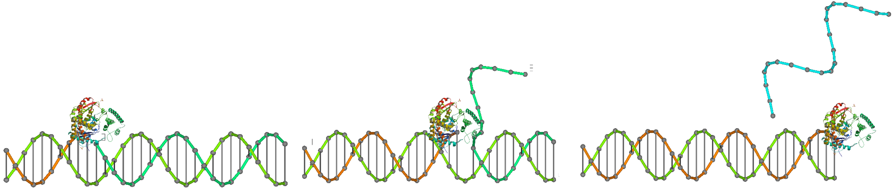
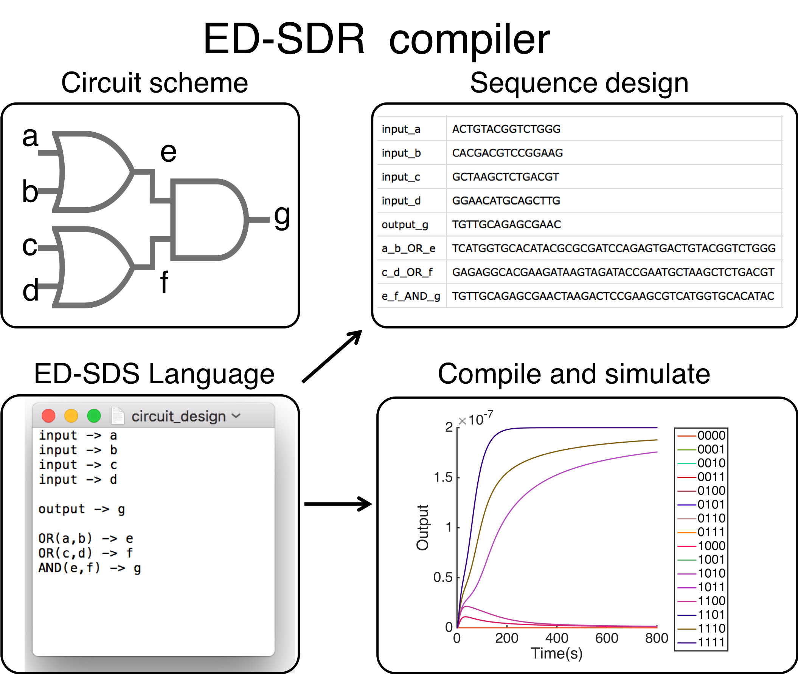

# ED-SDR compiler
- A package to design DNA molcular circuit driven by enzyme 
- Usage: 
  - the circuit design script is written in txt files
  - The design sequence will be in the circuit_design_seq.csv
  - The simulated results will be in the foler named as the design txt file.
  
